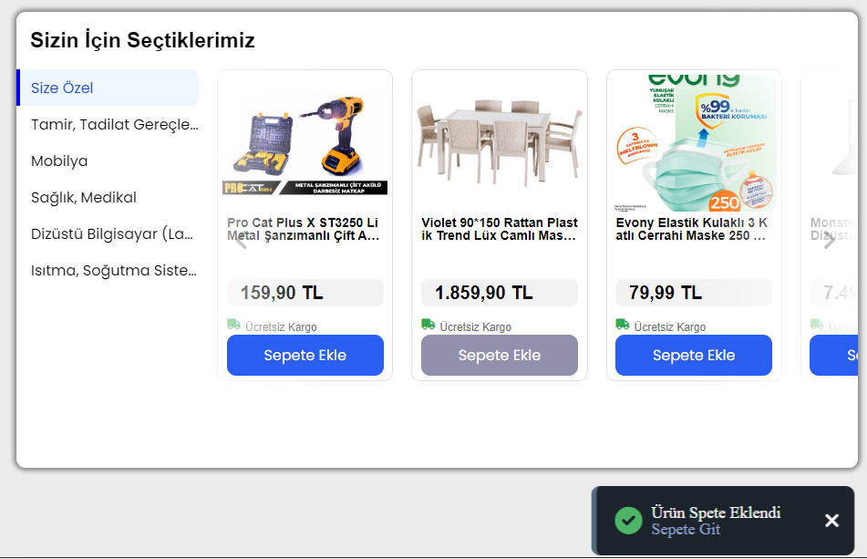

#  E-Commerce Website Sample

**Description :** This project consists of single page and it is about many diffrent products in different categories. 

**Features :**

- Product data is dynamically listed according to the selected category.
- Images are loaded according to the *lazy-load*.
- The products section is designed to be slideable.
- The project desing is responsive. (works properly in different resolutions)

 <h2> Preview </h2> 

    

